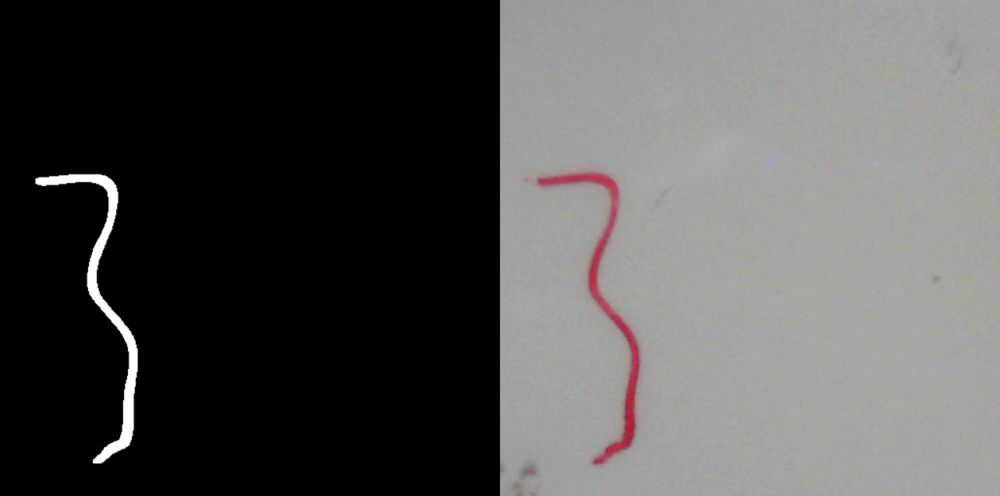

# Fast Segment Anything for Needle Biopsy and GigaFIBI with Fereidouni Lab and UC Davis Health

This is a fork of the original [FastSAM model](https://github.com/CASIA-IVA-Lab/FastSAM) developed by the CASIA-IVA-Lab. All credits for their original work go to them. 

FastSAM for needle biopsy is an image processing pipeline I am developing to quickly generate image segmentation masks from the [GigaFIBI microsope](https://opg.optica.org/abstract.cfm?uri=Microscopy-2024-MS1A.2). A fastest path is then generated from the mask such that it covers the tissue as quickly and effciently as possible. Here is an example of the mask generated. 

 

