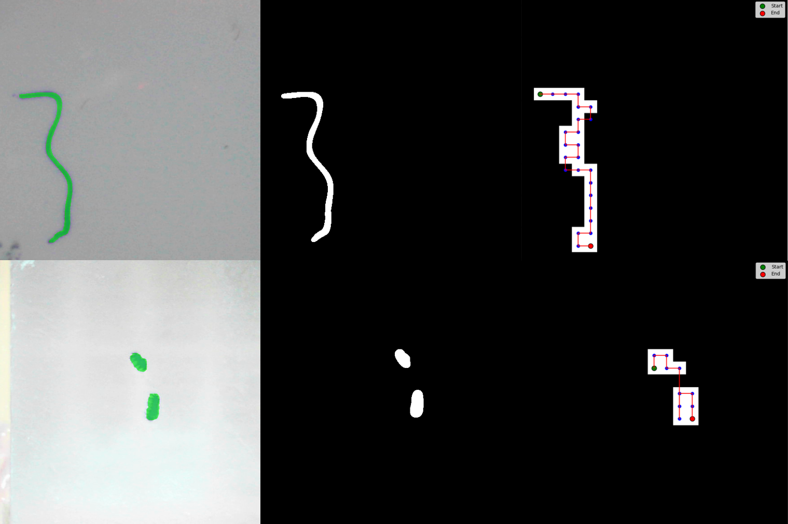

# Fast Segment Anything for Needle Biopsy and GigaFIBI with Fereidouni Lab and UC Davis Health

This is a fork of the original [FastSAM model](https://github.com/CASIA-IVA-Lab/FastSAM) developed by the CASIA-IVA-Lab. All credits for their original work go to them. 

FastSAM for needle biopsy is an image processing pipeline I am developing using FastSAM to quickly generate image segmentation masks from the [GigaFIBI microsope](https://opg.optica.org/abstract.cfm?uri=Microscopy-2024-MS1A.2) and other related projects in the lab. A fastest path is then generated from the mask such that it covers the tissue as quickly and effciently as possible. Here is an example of the mask generated. An example two images are shown below. 



## Installation (currently)

As it stands, I am not sure what is the best way to install this package. As you can see, this is primarily a python package but it is meant to be executed using `C#`. I would like to try to make this a `pip` package in the future but that remains to be seen. For now all you need to do is clone follow these steps:
```bash
git clone https://github.com/prakhargaming/FastSAM-needle-biopsy.git
conda create -n FastSAM python=3.10
conda activate FastSAM
cd FastSAM-needle-biopsy
pip install -r requirements.txt
```
Now you can run the scripts below. This repo requires python 3.10. You also need to do some stuff with the required `C#` packages but I am not there yet.

## Usage (currently)

### `./FastSAM_img_segmentation.py`

This program can be run in bash like this
```bash
python3 FastSAM_img_segmentation.py --model_path ./weights/FastSAM-x.pt --img_path ./tissue --microDims 21,21
```
This script can take many arguments. All masks and shortest paths will be saved in the specified directory. Here is the docstring:
```
Parameters:
    model_path (str): Path to the model weights file.
    img_path (str): Path to the image file or directory containing images.
    imgsz (int): Image size for processing.
    iou (float): IOU threshold for filtering the annotations.
    conf (float): Object confidence threshold.
    output (str): Directory to save the segmented images.
    point_prompt (str): Points prompt in the format "[[x1,y1],[x2,y2]]".
    point_label (str): Point labels in the format "[1,0]" (0: background, 1: foreground).
    box_prompt (str): Box prompt in the format "[[x,y,w,h],[x2,y2,w2,h2]]".
    better_quality (bool): Flag to use better quality using morphologyEx.
    device (str): Device to run the model on ("cuda", "mps", "cpu").
    retina (bool): Flag to draw high-resolution segmentation masks.
    withContours (bool): Flag to draw the edges of the masks.
    microDims (str): Dimensions of image resize for shortest path in the format "width,height".
    plot (bool): Flag to save and return plot of the results.
```
### `./csharp/Program.cs`

This will execute the above command but though `C#`. This is mainly for future development.

```bash
dotnet run
```

## Miscellaneous

### `make clean`
Make clean is used to clean to clean the contents of `./output`, the default output directory of `FastSAM_img_segmentation.py`. 
